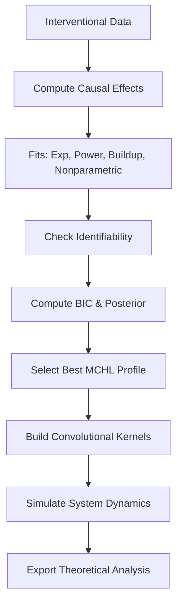

# MCEN: Markovian Causal Effect Networks

**MCEN (Markovian Causal Effect Networks)** is a principled framework for learning, modeling, and simulating dynamic causal relationships from interventional time-series data. It combines nonparametric and parametric decay modeling with formal statistical identifiability, theoretical guarantees, and convolutional propagation dynamics to infer long-range causal effects with uncertainty quantification and asymptotic properties.

> ⚠️ **NOTICE**: This is research code! Do not use in production.

---

## Overview

MCEN implements **MCHL (Markovian Causal Half-Life)** profiles to estimate how interventions propagate through a system over time. It supports multiple decay models (exponential, power law, buildup-power, and nonparametric kernel regression), performs model selection under identifiability constraints, and constructs a Convolutional Causal Dynamics system for simulation and forecasting.

### Key Features
- Theoretically grounded decay models with Fisher information and identifiability checks.
- Nonparametric local-linear smoothing with bandwidth cross-validation.
- Ensemble model selection via BIC and posterior weighting.
- Half-life and mass-half-life estimation for temporal persistence.
- Fisher Information Matrix (FIM) and asymptotic variance.
- Tail bounds and convergence rate analysis.
- Convolutional propagation kernels for system-level simulation.
- Information flow metrics using Jensen-Shannon divergence.

---

## Mathematical Foundations

### 1. Causal Effect Curve Estimation

Given interventional data, the average causal effect at lag $ k $ is estimated as:

%20=%20\mathbb{E}[Y(k)%20\mid%20\text{do}(I)]%20-%20\mathbb{E}[Y(k)%20\mid%20\text{do}(\text{control})])

This forms the empirical effect curve $ \{\tau(k)\}_{k=1}^K $, which is modeled using parametric or nonparametric decay functions.

---

### 2. Decay Models

MCEN supports four decay models:

#### (a) Exponential Decay

%20=%20\theta%20\cdot%20e^{-\lambda%20k})

- **Half-life**:  
  

#### (b) Power Law Decay

%20=%20\theta%20\cdot%20\left(1%20+%20\frac{k}{\kappa}\right)^{-\lambda})

- **Half-life**:  
  )

#### (c) Buildup-Power Decay (Rise-and-Decay)

%20=%20\theta%20\cdot%20\left(1%20-%20e^{-\lambda_{\text{rise}}%20k}\right)%20\cdot%20\left(1%20+%20\frac{k}{\kappa}\right)^{-\lambda_{\text{decay}}})

Models delayed peak effects.

#### (d) Nonparametric Kernel Regression

Uses local-linear smoothing:

%20=%20\arg\min_{a,b}%20\sum_i%20\left(\tau(k_i)%20-%20a%20-%20b(k_i%20-%20k)\right)^2%20K_h(k_i%20-%20k))

where the kernel is defined as:

%20=%20\frac{1}{h}K\left(\frac{u}{h}\right))

and $ K $ is the Gaussian kernel:

%20=%20\frac{1}{\sqrt{2\pi}}%20e^{-\frac{1}{2}u^2})

The bandwidth $ h $ is selected via **5-fold moving-block bootstrap cross-validation** to account for temporal dependencies in time-series data.

---

### 3. Identifiability Conditions

Each model is validated against formal identifiability criteria:

- **Fisher Information Matrix (FIM) Full Rank**: Ensures local identifiability.

  %20=%20\mathbb{E}\left[\left(\frac{\partial%20\log%20p}{\partial%20\theta}\right)^2\right])

  Computed numerically from model gradients.

- **FIM Condition Number**:  
  %20<%2010^3) for stability.

- **Parameter Separability**: Gradient vectors $ \nabla_{\theta_i} \tau(k) $ must be linearly independent.

- **Effective DoF**:  
   for nonparametric models.

- **CV Risk Stability**: Bandwidth perturbation test:  
  ,%20\text{CV}(1.2h))%20/%20\text{CV}(h)%20\leq%201.25)

---

### 4. Model Selection & Ensemble Inference

For each intervention, MCEN:
1. Fits all four models.
2. Filters for identifiability (≥80% condition satisfaction).
3. Computes BIC:

   %20+%20k%20\log%20n%20+%20\text{penalty}(t_{1/2}))

   where the penalty discourages half-lives beyond 75% of the observed horizon.

4. Computes posterior probabilities:

   %20\propto%20\exp\left(-\frac{1}{2}%20\text{BIC}_i\right))

5. Selects the highest-posterior model for the MCHL profile.

---

### 5. Mass Half-Life

A robust alternative to functional half-life:

%7C%20%5Cgeq%20%5Cfrac%7B1%7D%7B2%7D%20%5Csum_%7Bi%3D1%7D%5EK%20%7C%5Ctau(i)%7C%20%5Cbig%5C%7D)


---

### 6. Error & Convergence Analysis

- **Empirical Bernstein Bound** for effect curve confidence.
- **Delta Method** for half-life uncertainty.
- **Convergence Rate**: Adjusted from standard $ n^{-1/2} $ based on identifiability score, typically $ O(n^{-\gamma}) $, $ \gamma \in [0.35, 0.5] $.

---

## Architecture

### Core Classes

| Class | Purpose |
|-------|--------|
| `TheoreticalDecayModel` | Base class for decay functions with gradient, FIM, and identifiability. |
| `ExponentialDecay`, `PowerLawDecay`, `BuildupPowerDecay` | Parametric decay models with closed-form gradients and half-lives. |
| `NonparametricKernelDecay` | Local-linear smoother with CV bandwidth selection. |
| `ConvolutionalKernel` | Encapsulates discrete propagation kernel (Gaussian, exponential, power-law). |
| `ConvolutionalCausalDynamics` | Simulates system evolution via convolutional propagation. |
| `MCHLResult` | Stores fitted model, half-life, FIM, identifiability, SNR, and mass metrics. |
| `MCENSystem` | Main orchestrator: fits models, builds dynamics, simulates, validates. |

---

### Data Flow



---

## Usage Example

```python
import pandas as pd
from mcen import MCENSystem

# Load interventional data
data = pd.DataFrame({
    "intervention": ["A", "A", "B", "B", "control", "control"] * 10,
    "outcome": np.random.randn(60),
    "time_lag": [1,2,3,4,1,2,3,4]*15
})

# Initialize system
mcen = MCENSystem(variables=["A", "B", "outcome"])

# Learn MCHL profiles
results = mcen.learn_mchl_profiles(
    data,
    intervention_col="intervention",
    outcome_col="outcome",
    time_col="time_lag",
    baseline_intervention="control"
)

# Build convolutional dynamics
mcen.setup_convolutional_dynamics(outcome_var="outcome")

# Simulate intervention
trajectory = mcen.simulate_with_convolution({
    "intervention_var": "A",
    "intervention_value": 1.0,
    "initial_state": {"A": 0.0, "B": 0.0, "outcome": 0.0}
}, time_horizon=30)

# Export theoretical analysis
mcen.export_theoretical_analysis("mcen_analysis.pkl")
```

---

## Output & Diagnostics

Each `MCHLResult` includes:
- `decay_type`: Selected model.
- `parameters`: Fitted parameters (e.g., `theta`, `lambda`).
- `half_life`: Functional half-life.
- `mass_half_life`: Cumulative mass-based half-life.
- `r2_in_sample`: Goodness-of-fit.
- `snr`: Signal-to-noise ratio.
- `posterior_prob`: Model weight.
- `identifiability_conditions`: List of formal checks.
- `fisher_information_matrix`: For uncertainty quantification.
- `tail_bound`, `convergence_rate`: Theoretical error bounds.

---

## Theoretical Guarantees

MCEN validates and reports:
- Identifiability score (fraction of satisfied conditions).
- FIM rank and condition number.
- Asymptotic error bound: $ O(n^{-\gamma}) $, $ \gamma \in [0.35, 0.5] $.
- Bootstrap confidence intervals for nonparametric fits.

Use `validate_theoretical_properties()` to audit all profiles.

---

## Export Format

`export_theoretical_analysis()` saves a pickle file containing:
- MCHL results
- Theoretical guarantees
- System-wide information flows (JSD-based)
- Summary statistics