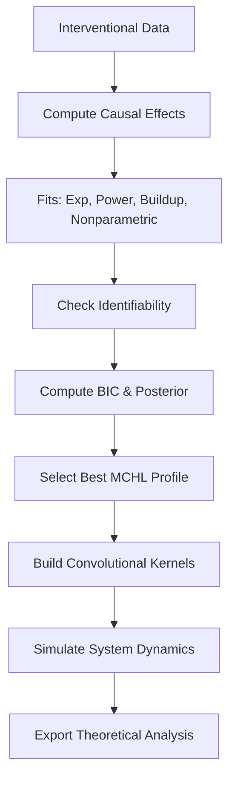

# MCEN: Markovian Causal Effect Networks

**MCEN** (Markovian Causal Effect Networks) is a principled framework for learning, modeling, and simulating dynamic causal relationships from interventional time-series data. It combines nonparametric and parametric decay modeling with formal statistical identifiability, theoretical guarantees, and convolutional propagation dynamics to infer long-range causal effects with uncertainty quantification and asymptotic properties.

> [!NOTICE]
> This is a reasearch code! Do not use in production!

---

## Overview

MCEN implements **MCHL** (Markovian Causal Half-Life) profiles to estimate how interventions propagate through a system over time. It supports multiple decay models (exponential, power law, buildup-power, and nonparametric kernel regression), performs model selection under identifiability constraints, and constructs a **Convolutional Causal Dynamics** system for simulation and forecasting.

Key features:
- **Theoretically grounded decay models** with Fisher information and identifiability checks.
- **Nonparametric local-linear smoothing** with bandwidth cross-validation.
- **Ensemble model selection** via BIC and posterior weighting.
- **Half-life and mass-half-life** estimation for temporal persistence.
- **Fisher Information Matrix (FIM)** and asymptotic variance.
- **Tail bounds** and convergence rate analysis.
- **Convolutional propagation kernels** for system-level simulation.
- **Information flow metrics** using Jensen-Shannon divergence.

---

## Mathematical Foundations

### 1. **Causal Effect Curve Estimation**

Given interventional data, the average causal effect at lag $ k $ is estimated as:

$$
\tau(k) = \mathbb{E}[Y(k) \mid \text{do}(I)] - \mathbb{E}[Y(k) \mid \text{do}(\text{control})]
$$

This forms the empirical **effect curve** $ \{\tau(k)\}_{k=1}^K $, which is modeled using parametric or nonparametric decay functions.

---

### 2. **Decay Models**

MCEN supports four decay models:

#### (a) Exponential Decay
$$
\tau(k) = \theta \cdot e^{-\lambda k}
$$
- Half-life: $ t_{1/2} = \frac{\ln 2}{\lambda} $

#### (b) Power Law Decay
$$
\tau(k) = \theta \cdot \left(1 + \frac{k}{\kappa}\right)^{-\lambda}
$$
- Half-life: $ t_{1/2} = \kappa \left(2^{1/\lambda} - 1\right) $

#### (c) Buildup-Power Decay (Rise-and-Decay)
$$
\tau(k) = \theta \cdot \left(1 - e^{-\lambda_{\text{rise}} k}\right) \cdot \left(1 + \frac{k}{\kappa}\right)^{-\lambda_{\text{decay}}}
$$
- Models delayed peak effects.

#### (d) Nonparametric Kernel Regression
Uses local-linear smoothing:
$$
\hat{\tau}(k) = \arg\min_{a,b} \sum_i \left(\tau(k_i) - a - b(k_i - k)\right)^2 K_h(k_i - k)
$$
where $ K_h(u) = \frac{1}{h}K\left(\frac{u}{h}\right) $, and $ K $ is the Gaussian kernel.

Bandwidth $ h $ selected via **5-fold moving-block bootstrap CV**.

---

### 3. **Identifiability Conditions**

Each model is validated against formal identifiability criteria:

- **Fisher Information Matrix (FIM) Full Rank**: Ensures local identifiability.
  $$
  \mathcal{I}(\theta) = \mathbb{E}\left[\left(\frac{\partial \log p}{\partial \theta}\right)^2\right]
  $$
  Computed numerically from model gradients.

- **FIM Condition Number**: $ \text{cond}(\mathcal{I}) < 10^3 $ for stability.

- **Parameter Separability**: Gradient vectors $ \nabla_{\theta_i} \tau(k) $ must be linearly independent.

- **Effective DoF**: $ 2 \leq \text{df}_{\text{eff}} \leq 0.7n $ for nonparametric models.

- **CV Risk Stability**: Bandwidth perturbation test: $ \max(\text{CV}(0.8h), \text{CV}(1.2h)) / \text{CV}(h) \leq 1.25 $

---

### 4. **Model Selection & Ensemble Inference**

For each intervention, MCEN:
1. Fits all four models.
2. Filters for **identifiability** (≥80% condition satisfaction).
3. Computes **BIC**:
   $$
   \text{BIC} = n \log(\sigma^2) + k \log n + \text{penalty}(t_{1/2})
   $$
   where penalty discourages half-lives beyond 75% of observed horizon.
4. Computes **posterior probabilities**:
   $$
   P(M_i) \propto \exp\left(-\frac{1}{2} \text{BIC}_i\right)
   $$
5. Selects highest-posterior model for MCHL profile.

---

### 5. **Mass Half-Life**

A robust alternative to functional half-life:
$$
t_{\text{mass}, 1/2} = \min \left\{ k : \sum_{i=1}^k |\tau(i)| \geq \frac{1}{2} \sum_{i=1}^K |\tau(i)| \right\}
$$

---

### 6. **Error & Convergence Analysis**

- **Empirical Bernstein Bound** for effect curve confidence.
- **Delta Method** for half-life uncertainty.
- **Convergence Rate**: Adjusted from standard $ n^{-1/2} $ based on identifiability score.

---

## Architecture

### Core Classes

| Class | Purpose |
|------|--------|
| `TheoreticalDecayModel` | Base class for decay functions with gradient, FIM, and identifiability. |
| `ExponentialDecay`, `PowerLawDecay`, `BuildupPowerDecay` | Parametric decay models with closed-form gradients and half-lives. |
| `NonparametricKernelDecay` | Local-linear smoother with CV bandwidth selection. |
| `ConvolutionalKernel` | Encapsulates discrete propagation kernel (Gaussian, exponential, power-law). |
| `ConvolutionalCausalDynamics` | Simulates system evolution via convolutional propagation. |
| `MCHLResult` | Stores fitted model, half-life, FIM, identifiability, SNR, and mass metrics. |
| `MCENSystem` | Main orchestrator: fits models, builds dynamics, simulates, validates. |

---

### Data Flow



---

## Usage Example

```python
import pandas as pd
from mcen import MCENSystem

# Load interventional data
data = pd.DataFrame({
    "intervention": ["A", "A", "B", "B", "control", "control"] * 10,
    "outcome": np.random.randn(60),
    "time_lag": [1,2,3,4,1,2,3,4]*15
})

# Initialize system
mcen = MCENSystem(variables=["A", "B", "outcome"])

# Learn MCHL profiles
results = mcen.learn__mchl_profiles(
    data,
    intervention_col="intervention",
    outcome_col="outcome",
    time_col="time_lag",
    baseline_intervention="control"
)

# Build convolutional dynamics
mcen.setup_convolutional_dynamics(outcome_var="outcome")

# Simulate intervention
trajectory = mcen.simulate_with_convolution({
    "intervention_var": "A",
    "intervention_value": 1.0,
    "initial_state": {"A": 0.0, "B": 0.0, "outcome": 0.0}
}, time_horizon=30)

# Export theoretical analysis
mcen.export_theoretical_analysis("mcen_analysis.pkl")
```

---

## Output & Diagnostics

Each `MCHLResult` includes:
- `decay_type`: Selected model.
- `parameters`: Fitted parameters (including `theta`, `k0`).
- `half_life`: Functional half-life.
- `mass_half_life`: Cumulative mass-based half-life.
- `r2_in_sample`: Goodness-of-fit.
- `snr`: Signal-to-noise ratio.
- `posterior_prob`: Model weight.
- `identifiability_conditions`: List of formal checks.
- `fisher_information_matrix`: For uncertainty quantification.
- `tail_bound`, `convergence_rate`: Theoretical error bounds.

---

## Theoretical Guarantees

MCEN validates and reports:
- Identifiability score (fraction of satisfied conditions).
- FIM rank and condition number.
- Asymptotic error bound: $ O(n^{-\gamma}) $, $ \gamma \in [0.35, 0.5] $.
- Bootstrap confidence intervals for nonparametric fits.

Use `validate_theoretical_properties()` to audit all profiles.

---

## Export Format

`export_theoretical_analysis()` saves a pickle with:
- MCHL results
- Theoretical guarantees
- System-wide information flows (JSD-based)
- Summary statistics
